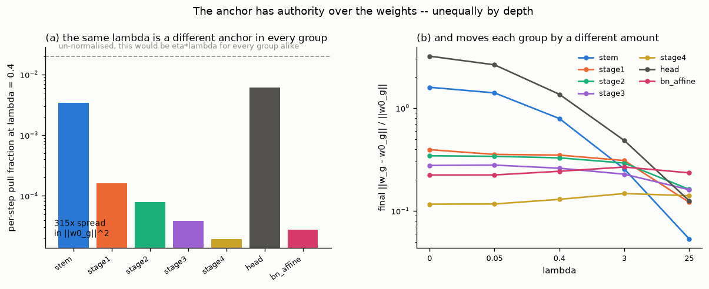
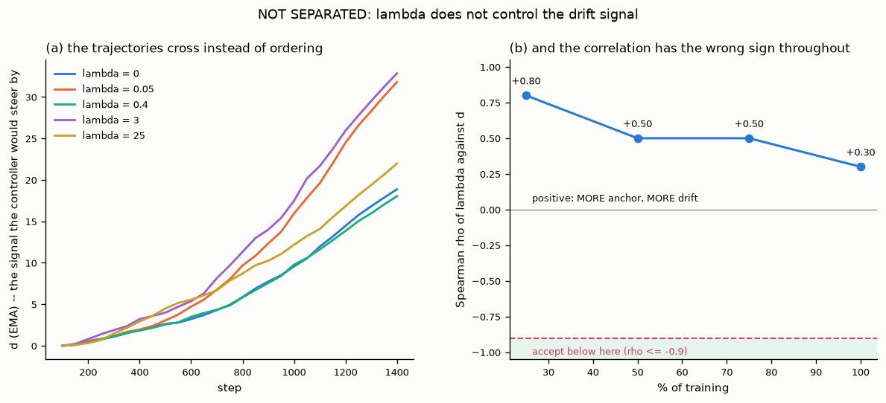
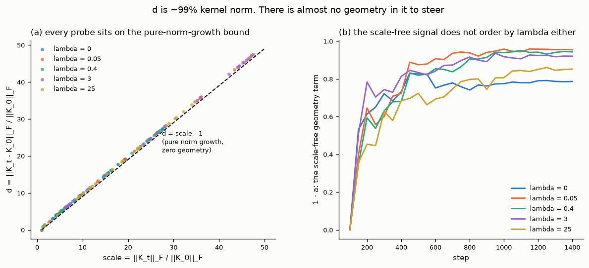
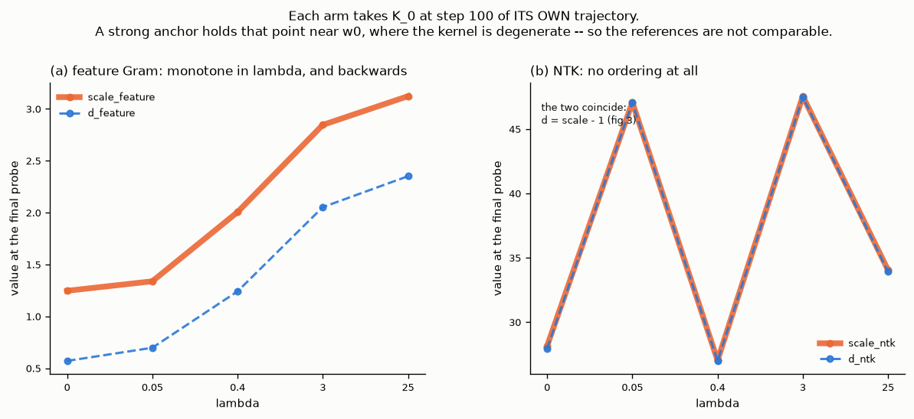
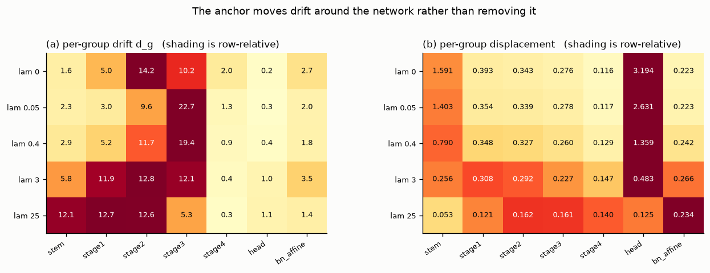
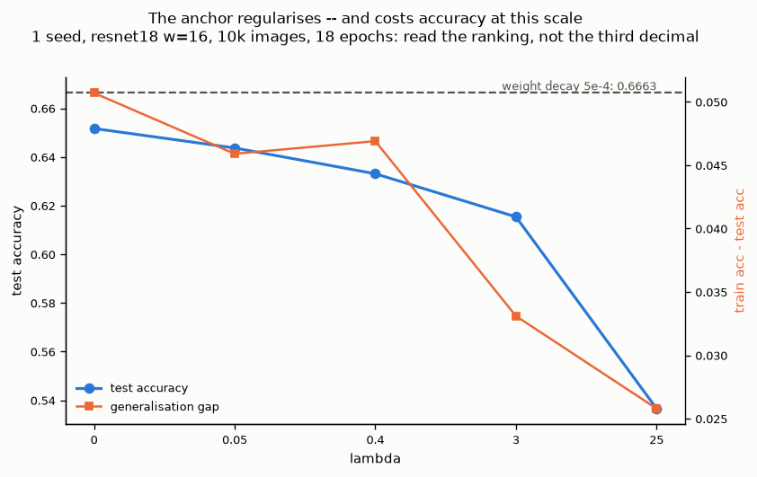
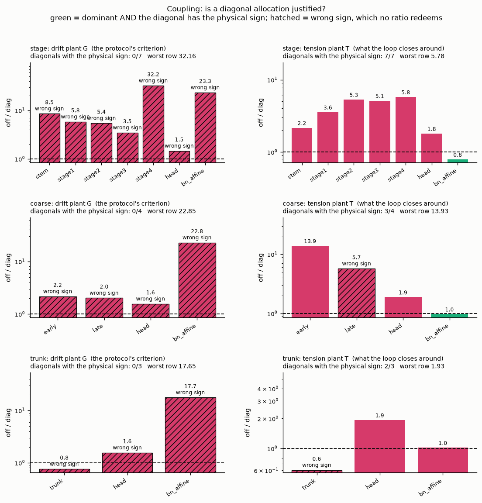
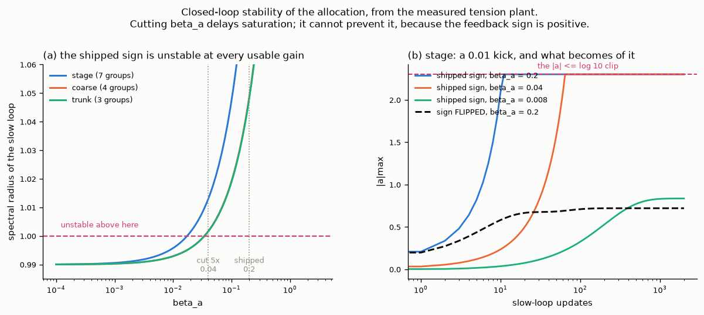

# Per-layer anchored L2: a homotopy whose coefficient is measured, not tuned

**Status: negative result on the measurement, positive on the mechanism.**
The per-group anchor is implemented and passes seven of its eight correctness
gates. Three findings, in increasing order of how cheaply they could have been
had:

1. The anchor has real, monotone authority over the weights — but the NTK-drift
   statistic the controller steers by does not respond to it, at any λ in the
   ladder. **Stage 1's go/no-go fails**, with the correlation pointing the wrong
   way (§4.2).
2. The plant a per-group allocation would run on is **not diagonal at any
   grouping**, and the protocol's prescribed remedy — coarsening — makes it worse
   rather than better (§4.7).
3. Against that measured plant the allocation's **feedback sign is positive**, so
   it saturates at its clip at any usable gain. Cutting `β_a` by 5× does not fix
   it; nothing but a sign does (§4.8).

No adaptive or per-group arm was run. Findings 1 and 2 point the same way and were
measured on almost nothing in common — a λ sweep on CIFAR-10 and finite
differences on synthetic data — which is what makes the result worth writing down.
Finding 3 needed no training at all.

Every figure and every number below is regenerated by `python results.py` — the
pilot's from the pulled run data, §4.7's from the coupling dumps `make selfcheck`
writes. §2's pass/fail verdicts come from `make selfcheck` itself. Nothing here is
quoted from memory.

---

## 1. What was built

The starting point (branch `adaptative-L2`) drives one scalar coefficient λ by a
measured NTK drift, applied as a decoupled pull after `optimizer.step()`. Four
parameter *roles* each received λ times a fixed, hand-set ratio.

This branch replaces those ratios with a measured allocation. The penalty becomes
per group and normalised by each group's own anchor norm:

```
F(w) = L(w) + Σ_g (λ_g/2) · ‖w_g − w₀g‖² / ‖w₀g‖²

w_g ← w_g − η_k ∇L − η_k · λ_g · (w_g − w₀g) / ‖w₀g‖²
```

and λ_g is produced by two loops running an order of magnitude apart:

```
log λ_g = u + a_g,        Σ_g a_g = 0
```

`u` is the **level** — the existing drift-tracking integrator, unchanged. `a_g` is
the **allocation**, a new slow loop that fires once every `anchor_alloc_every`
probes. The sum-to-zero constraint is what keeps them separable: the allocation
can only redistribute the anchor between groups, never change its strength, so
the level's transfer function is untouched by anything the allocation does.

The allocation is driven by **tension**, not by per-group drift:

```
τ_g = ‖∇_g L‖ · ‖w₀g‖² / (λ_g · ‖w_g − w₀g‖ + ε)
```

the ratio of gradient force to anchor force. `τ_g > 1` means the group is
anchor-limited — the data wants it to move and the anchor is what stops it — so
it should be given more of the budget. The update is a log-space integrator on
the deviation of `log τ_g` from its mean across groups, with shrinkage toward
uniform. Tension is local by construction; `d_g` responds to every λ at once.

**Groups** (`anchor_grouping`, coarse to fine): `trunk` (3), `coarse` (4), or
`stage` (7 — `stem`, `stage1..4`, `head`, `bn_affine`). Biases are never anchored.
Per tensor is not offered.

### The protocol this follows

The method is deliberately gated, and the gates are the reason a negative result
arrives in an afternoon rather than after a week of GPU time. Each stage decides
whether the next is worth running:

| stage | what it asks | where |
| --- | --- | --- |
| 0 | is the arithmetic right? | `make selfcheck` — §2 |
| 1 | does λ control drift *monotonically*? | `make pilot` — §4.2 |
| 2 | fit `β = 1/g` and `D_max` from stage 1 | `make pilot-check` |
| 3 | run the closed loop, and the allocation on top of it | `make anchor`, `make alloc` |

Stage 1 is the go/no-go: if `d(t)` does not order in λ, there is no gain `g` to
fit, so stage 2 has no output and stage 3 cannot start. `anchor.yaml`,
`alloc.yaml` and `cpucompare.yaml` all ship with `anchor_beta: 0.0`, which makes
config validation refuse them outright, precisely so a missing stage 2 cannot be
skipped past by accident.

Code: `src/cifarbase/anchor.py` (partition, `w₀`, the pull),
`src/cifarbase/controller.py` (`DriftController` for the level, `Allocator` for
the allocation), `src/cifarbase/kernel.py` (the sketch and its per-group
decomposition).

### One implementation fact worth keeping

The empirical NTK decomposes exactly over a parameter partition,
`K = Σ_g K^(g)`, and masking each frozen tangent to one group estimates the
blocks. The sketch **matrix** inherits that additivity, since `Jv = Σ_g J_g v`.
The sketch **Gram** does not: `K̂ = MMᵀ` expands to `Σ_g Σ_h (J_g v)(J_h v)ᵀ`, and
the `g ≠ h` cross terms are zero in expectation but not at R = 8. So the per-group
shares of `‖K₀‖_F` need not sum to 1, and they land on either side of it: **1.11
to 1.64** across the pilot's ladder, against **0.87** on a small synthetic net at
initialisation.

This matters beyond bookkeeping. Recovering the global sketch as `Σ_g M_g` is
accurate to ~1e-7 in float32 — the same size as the spurious `d` near `w₀` that
the float64 block algebra exists to suppress — so it would have made the number
the controller steers by depend on whether the per-group sketch happened to fire
that probe. The global sketch is therefore taken directly, and `d` is now bitwise
identical with and without the per-group decomposition. `probe_group_every` is a
logging knob, not a measurement one.

---

## 2. Correctness gates

Run with `make selfcheck`, on synthetic seeded data, no dataset and no GPU. Each
catches a failure whose symptom is a run that looks entirely normal.

| gate | certifies |
| --- | --- |
| **K0** | the NTK is continuous where `K₀` is taken |
| **H1** | the pull reaches `w₀`: `‖w−w₀‖ ~ 1/λ`, and the exponent in `d ~ ‖w−w₀‖^p` lands between sqrt and linear. Also re-runs the sweep with `anchor_normalize` on at `λ_g = 0.99‖w₀g‖²/η` — the same realised pull — and requires the same residual, which is a direct check that the divisor is applied per group |
| **H2** | `λ = 0` is bitwise identical to the plain loop, and the probe consumes no global RNG draw |
| **H3** | two probes at the same `w` return bitwise-equal `d` |
| **H4** | a probe leaves BatchNorm's running statistics untouched |
| **H5** | the implemented homotopy is the closed form `δ*(λ) = Φᵀ(K₀ + nλI)⁻¹r`, checked on both magnitude and the `λ^{-1/2}` trend |
| **H6** | 2 epochs equals 1 + resume + 1, bit for bit across weights, `w₀`, `K₀`, probe indices, controller state and the whole probe stream |
| **H7** | the per-group plant is diagonally dominant enough for a diagonal allocation. **Fails** — §4.7 |

K0 and H1–H6 pass on the code that produced the results below. H7 fails at every
grouping tested, which is its own result and is reported in §4.7 rather than
hidden here.

---

## 3. Setup

A CPU kernel on Kaggle (`cifar-10-per-layer-l2-cpu`), deliberately small enough to
answer the go/no-go in one session.

| | |
| --- | --- |
| architecture | ResNet-18, width 16 (701k params) |
| data | 10,000 CIFAR-10 train images, batch 128 → **1,404 steps** |
| schedule | SGD, lr 0.05, momentum 0.9, nesterov, cosine, 1 warmup epoch, 18 epochs |
| probe | 100 fixed class-balanced images every 50 steps, R = 4 tangents, NTK; per-group sketch every 7th probe |
| arms | `baseline_wd` (weight decay 5e-4, no anchor) and λ ∈ {0, 0.05, 0.4, 3, 25} |
| seeds | **1** |
| cost | 53 min of training; 81 min of kernel wall clock |

**The λ ladder was re-centred, and this is not cosmetic.** The normalisation moved
the stability bracket from `[1/(ηT), 0.5/η]` to
`[min_g‖w₀g‖²/(ηT), 0.5·min_g‖w₀g‖²/η]`, which at this scale is **[0.046, 32.5]**.
The pre-normalisation ladder `{1e-4 … 1}` would have sat almost entirely below
`λ_min` — five arms of an anchor doing nothing, which is indistinguishable from an
anchor that cannot control drift.

---

## 4. Results

### 4.1 The anchor has authority over the weights — very unequally by depth



The per-step pull fraction is `η·λ_g/‖w₀g‖²`. Because `‖w₀g‖²` spans **315×**
across the partition (head 3.25, stage4 1023), so does the fraction: at λ = 0.4 it
is 6.2e-3 on the head and 2.0e-5 on stage4. Un-normalised it would be `η·λ` for
every group alike.

The displacement panel is that arithmetic showing up in the weights. `stem`
(1.591 → 0.053) and `head` (3.194 → 0.125) fall monotonically by ~30× across the
ladder. `stage4` (0.116 → 0.140) and `bn_affine` (0.223 → 0.234) are flat or
mildly *inverted* — pinning the small-norm groups leaves the large ones doing more
of the fitting, not less.

So the mechanism works, and the normalisation does something subtler than the
phrase "dimensionless and comparable across depth" suggests. It makes the
*penalty* relative to each group's own scale; it does **not** equalise the
relaxation rate, and in fact makes it 315× unequal.

### 4.2 The go/no-go: λ does not control the drift signal



Stage 1 asks whether `d(t)` orders monotonically in λ. It does not, and the rank
correlation has the wrong sign at every point in training:

| % of training | 25 | 50 | 75 | 100 |
| --- | --- | --- | --- | --- |
| Spearman ρ (λ vs `d`) | **+0.80** | **+0.50** | **+0.50** | **+0.30** |

Acceptance is ρ ≤ −0.9. The `d_T` spread across the whole ladder is 1.82×, against
a 1.5× minimum — but spread without ordering is not control. There is nothing here
for a controller to close a loop around, at any β.

### 4.3 Why: `d` is kernel norm, not geometry



The three logged quantities satisfy `d² = scale² − 2·a·scale + 1`, so
`d ≥ scale − 1` with equality when the geometry is unchanged. Every probe of every
arm sits on that bound. Final `scale_ntk` runs 27–47 with `a_ntk` of 0.05–0.21:
the kernel's **norm grows ~30×** in every arm including λ = 0, and `d` is almost
entirely reporting that.

The anchor constrains `‖w − w₀‖`. It does not constrain the kernel's norm, which
BatchNorm and the weight norms drive — and `bn_affine`'s displacement is flat
across the entire ladder (§4.1). So λ has little purchase on the quantity `d`
measures, however much purchase it has on the weights.

The scale-free alternative does not rescue it. `1 − a` at the final probe is
0.786, 0.954, 0.943, 0.920, 0.852 across the ladder — non-monotone. Switching
`probe_signal` to `alignment` would not have produced separation either.

### 4.4 The reference point moves with λ



The feature Gram separates *perfectly* monotonically — and backwards. Final
`d_feature` goes 0.57 → 2.35 and `scale_feature` 1.25 → 3.12 as λ rises: anchoring
harder makes the features appear to drift **more**.

Both are consistent with `‖K₀‖` being smaller in the anchored arms. Each arm takes
`K₀` at step 100 of *its own* trajectory, and a strong anchor holds that point
near `w₀` — which with `zero_init_residual` is the ReLU-kink degeneracy the K0
gate measures, where the kernel is genuinely discontinuous. The arms are then not
measuring drift from comparable references at all, and a sweep over λ is partly a
sweep over reference points.

This is a hypothesis consistent with the evidence, not an isolated result: no
experiment here varies the reference step alone. §6 says how to settle it.

### 4.5 The anchor redistributes drift rather than removing it



At λ = 0 the drift concentrates in `stage2` (14.2) and `stage3` (10.2). At λ = 25
it has moved to `stem` (12.1), `stage1` (12.7) and `stage2` (12.6), while `stage3`
falls to 5.3 and `stage4` to 0.28. The total barely moves.

That is the same story as §4.1 seen in the kernel rather than in the weights: a
single λ pins whichever groups it has authority over, and the network does its
learning somewhere else.

### 4.6 What it cost



| arm | λ | test | train | gap |
| --- | --- | --- | --- | --- |
| `baseline_wd` | — (wd 5e-4) | **0.6663** | 0.7151 | +0.0488 |
| `lam0` | 0 | 0.6517 | 0.7024 | +0.0507 |
| `lam0p05` | 0.05 | 0.6437 | 0.6896 | +0.0459 |
| `lam0p4` | 0.4 | 0.6331 | 0.6800 | +0.0469 |
| `lam3` | 3 | 0.6154 | 0.6485 | +0.0331 |
| `lam25` | 25 | 0.5366 | 0.5624 | +0.0258 |

Accuracy falls monotonically in λ while the generalisation gap also falls
(0.051 → 0.026). The anchor *is* regularising; at this scale it is a net loss, and
weight decay wins. One seed at 1,404 steps — read the ranking, not the third
decimal.

### 4.7 Coupling: a diagonal allocation is not justified at any grouping



The allocation is a *diagonal* controller — it moves each group's `a_g` from that
group's own signal. That is only sound if the plant is close to diagonal.
Perturbing one group's `log λ` by ±0.5, training 200 steps and differencing gives
the plant; dominance is `|G_ℓℓ| > Σ_{m≠ℓ}|G_ℓm|` on every row.

**Two plants, and they disagree.** The protocol states the criterion on the drift
plant `G_ℓm = −∂d_ℓ/∂log λ_m`. But the slow loop integrates `log τ`, not `d`, so
what it actually closes around is `T_ℓm = −∂log τ_ℓ/∂log λ_m` — a different
operator, with a structural `+1` on its diagonal from the explicit `λ_ℓ` in `τ`'s
denominator. Both are measured from the same runs:

| grouping | drift `G` off/diag | correct signs | tension `T` off/diag | correct signs |
| --- | --- | --- | --- | --- |
| `stage` (7) | 1.46 – 32.16 | **0/7** | 0.79 – 5.78 | **7/7** |
| `coarse` (4) | 1.56 – 22.85 | **0/4** | 0.97 – 13.93 | 3/4 |
| `trunk` (3) | 0.76 – 17.65 | **0/3** | 0.60 – 1.93 | 2/3 |

Three things follow.

**The drift plant's diagonal has the wrong sign everywhere — 0/N at every
grouping.** `G_ℓℓ < 0` means `∂d_ℓ/∂log λ_ℓ > 0`: tightening a group's own anchor
*increases* its own drift. This is independent corroboration of §4.2, from a
different setup (synthetic Gaussians, 200 steps) by a different method (finite
differences rather than a λ sweep). Two measurements with almost nothing in common
agree that drift responds to the anchor backwards, which makes that finding much
harder to write off as an artefact of the pilot's small scale.

**The tension plant is materially healthier, and still fails.** At `stage` every
diagonal has the physical sign and the worst row is 5.78 rather than 32.2. Judged
on the operator the loop actually touches, the design looks like a tuning problem;
judged on the protocol's operator it looks dead. Neither reading passes, but they
are not the same verdict and the document should not collapse them.

**Coarsening is not the remedy the protocol assumes.** §7 of the protocol says a
failed coupling gate should be answered by coarsening the grouping or cutting
`β_a` by 5×. Coarsening does not behave monotonically here: `coarse` is *worse*
than both its neighbours on the tension plant (worst row 13.93, against 5.78 at
`stage` and 1.93 at `trunk`), and it loses a diagonal sign. Merging
`stem`+`stage1`+`stage2` into `early` collapsed the diagonal from +0.540/+0.158/
+0.093 individually to **+0.037** together while the off-diagonal mass stayed at
0.515 — the merged groups' responses partly cancel. And `trunk`, which gets the
ratios closest to acceptable, does it by flipping the trunk row's own sign to
−0.224. There is no rung of this ladder that passes.

Baseline `τ_ℓ` sits at 0.09–0.18 across every group and every grouping — all
groups anchor-dominated, and tightly clustered, so the differential signal the
allocation integrates is small to begin with.

### 4.8 Closed-loop stability: the allocation's feedback sign is positive



§4.7 asks whether the plant is diagonal. This asks the question that actually
decides whether the loop can be run at all: *given* that plant, does the update
rule converge? It needs no training — it is linear algebra on the matrices §4.7
already measured.

Linearising `Allocator._update` around the measured plant, with
`log τ(a) = log τ₀ − T a`, the slow loop is

```
a ← a − β_a · P(log τ) − γ a      =      [(1 − γ)I + β_a · P T] a  +  const
```

so it converges iff the spectral radius of `(1 − γ)I + β_a·P T` is below 1 on the
zero-sum subspace. **Every eigenvalue of `P T` is positive real** — 0.121 … 0.575
at `stage`, and likewise at `coarse` and `trunk`. So `ρ = 0.99 + β_a·λ`, which
exceeds 1 for any `β_a > γ/λ_max`.

| `β_a` | ρ (`stage`) | simulated from a 0.01 kick |
| --- | --- | --- |
| 0.2 — shipped | 1.105 | pinned at the ±log 10 clip after **12** updates |
| 0.04 — cut 5× | 1.013 | pinned at the clip after **66** updates |
| 0.008 — cut 25× | 0.9946 | converges, \|a\|max = 0.836 |

**Cutting `β_a` by 5× — the protocol's second remedy for a failed coupling gate —
does not fix this.** It moves ρ from 1.105 to 1.013, still above 1, and delays
saturation rather than preventing it. The shipped sign converges only for
`β_a < γ/λ_max = 0.01739`, eleven times smaller than shipped, and at that gain the
γ shrinkage dominates the feedback — the allocation is switched off in all but
name.

The cause is a sign, not a gain. `T_ℓℓ > 0` means raising `λ_ℓ` *lowers* `τ_ℓ`.
The update lowers `a_ℓ` when `τ_ℓ` is high, which lowers `λ_ℓ`, which raises
`τ_ℓ` further. That is positive feedback. Flipping only the feedback term makes
the loop converge for `β_a < 3.46` — a 200× wider margin — and it settles to a
fixed point at every gain tried (dashed line in panel b).

This traces back to a disagreement inside the protocol's own §3. The formula
`τ_g = ‖∇_g L‖·‖w₀g‖²/(λ_g‖δ_g‖)` makes `τ > 1` the group whose *gradient* force
exceeds its anchor force — a group the anchor is **not** binding. The prose calls
`τ > 1` "anchor-limited and wants more drift budget", and the update sign follows
the prose. The measurement says the formula is right and the gloss is backwards.
The code implements the protocol as written and has not been changed.

---

## 5. Discussion

**The pull works; whether the *premise* works is the open question.** The
per-group normalised pull does exactly what it is specified to do, monotonically,
over ~30× in displacement. Beyond that the data admits two readings, and this
experiment does not separate them:

1. *The signal is broken.* `d` is ~99% kernel norm (§4.3), the scale-free
   alternative does not order either, and the reference point is confounded with
   the arm (§4.4). On this reading the homotopy is fine and the instrument is not.
2. *The premise is broken.* Constraining `‖w_g − w₀g‖` may simply not constrain
   the kernel. §4.5 is the uncomfortable evidence: as λ rises the drift moves from
   `stage2`/`stage3` to `stem`/`stage1` and the total barely changes. A budget
   that is conserved under the thing meant to control it is not a budget.

Reading 1 is the more likely of the two given how completely `d` collapses onto
the norm bound, and it is also the cheaper to test — the first three
experiments in §6 are all instrument fixes. But reading 2 would not be visible until the instrument is repaired, so it
cannot be dismissed on this data, and it is the more expensive to be wrong about.

**The case for a per-group allocation is stronger than ever, and it is still not
justified.** The 315× spread (§4.1) is the best evidence yet that a single shared
λ *cannot* hold all seven groups at once, which is the entire premise of
allocating. But §4.7 says the plant a diagonal allocation would run on is not
diagonal at any grouping, and that the groups an allocation would most need to
tighten (`stage4`, `bn_affine`) are exactly the ones λ has least authority over.
Motive without means.

**The gate as specified may be judging the wrong operator, and that matters more
than it sounds.** The protocol states the coupling criterion on the drift plant;
the loop integrates tension. On the drift plant the diagonal has the wrong sign at
every grouping and the design reads as dead. On the tension plant every diagonal
at `stage` has the right sign and the worst row is 5.78 — a bad controller, not an
impossible one. The distinction is worth preserving because the two suggest
different next moves: repair the instrument, or retune the loop.

**And the loop, as written, could not have converged.** §4.8 is the cheapest and
sharpest result here: the allocation's feedback sign is positive, so it saturates
at its clip at any usable gain. Had the pilot separated and the adaptive arms run,
they would have produced an allocation pinned at ±log 10 — a 100× spread in λ
across groups, arrived at by a runaway rather than by measurement — and a λ trace
that looks entirely plausible in a plot. It is worth being explicit that stage 1
failing is what stopped that from being discovered the expensive way.

**No adaptive or per-group arm was run.** Both need `anchor_beta` and
`anchor_dmax`, which are outputs of this pilot — and the pilot says the gain `g`
they derive from does not exist. `anchor.yaml`, `alloc.yaml` and `cpucompare.yaml`
all ship refusing to start for exactly this reason. Running them anyway would
produce a controller tracking a schedule nobody chose, and a lambda trace that
looks like a controller working.

---

## 6. Limitations, and what would settle it

**Limitations.** One seed. Width 16 on a 10k subset for 18 epochs is a CPU proxy,
not the reference recipe — the kernel-scale problem may well be milder at width 64
over 100 epochs, where the network is not being asked to learn so fast. The
reference-confound account in §4.4 is inferred from `scale_feature`, not isolated.
And `d`'s scale dominance was already documented at full scale before this work,
so §4.3 is a reproduction, not a discovery.

**The smallest experiments that would settle it**, each a config change away:

1. **A shared reference across arms.** Take `K₀` once, from the λ = 0 trajectory,
   and reuse it for every arm. This isolates §4.4's confound directly — currently
   `anchor_reference_step` is per arm by construction.
2. **Remove the degeneracy.** `zero_init_residual: false`, so `w₀` is not a point
   where the NTK is discontinuous, and re-run the ladder.
3. **Sweep the reference step.** `anchor_reference_step` over a few values at
   fixed λ. If `d_T` moves a lot, the reference is the confound and the whole
   `d`-based design needs a different anchor point before it can be judged.
4. **Steer something the anchor can actually reach.** The per-group displacement
   `‖w_g − w₀g‖/‖w₀g‖` orders monotonically over 30× and is free to compute. It is
   not a feature-learning budget — that was the point of the NTK — but a homotopy
   that controls it is at least a homotopy that controls something.

**On the coupling gate specifically** (§4.7), two things are worth adding to the
list. Cutting `anchor_alloc_beta_frac` by 5× is the protocol's other remedy and
has not been tried — it does not make the plant more diagonal, but a slow enough
diagonal loop on a coupled plant can still be stable, so it is a cheap thing to
measure. And the gate itself is a proxy: a width-16 ResNet on 32 synthetic
Gaussians for 200 steps, with R = 4 tangents. Before the coupling result is
treated as settled it should be re-measured on CIFAR-10 at the pilot's own scale,
which is a few hundred steps per group and well within a CPU session.

A caution about coarsening. It is the protocol's first-listed remedy and, on this
evidence, it is not reliable: `coarse` is worse than both `stage` and `trunk`.
Coarsening should be chosen by measuring the plant at each candidate partition,
not by assuming fewer groups is a safer default.

**The stability analysis in §4.8 is linear and local.** It assumes `log τ` is
affine in `a` with the Jacobian measured at one operating point, and the real loop
runs against a plant that moves as training proceeds. What it establishes solidly
is the *sign*: `P T` has all-positive eigenvalues, and the shipped update
therefore has positive feedback at this operating point. What it does not
establish is the precise gain at which a real run would saturate. The
simulation's 12 and 66 updates are indicative, not predictions.

---

## 7. Reproducing

```sh
make pull-cpu        # fetch the kernel's output into out-cpu/
make results         # regenerate docs/img/*.png and print every number above
make pilot-check     # the separation verdict, independently
make selfcheck       # the correctness gates
```

`results.py` prints a `NUMBERS` block containing every pilot scalar quoted in
this document; §2's gate numbers come from `make selfcheck`. A pilot number here
that the script does not print is stale.

Run directory: `out-cpu/runs/20260907-144502_cpupilot_resnet18/`, six arms, each
with `results.json`, `history.{jsonl,csv}` and `probes.{jsonl,csv}` (29 probes ×
89 columns).

§4.7's matrices and §4.8's stability analysis both come from the dumps
`make selfcheck` writes: one `coupling_G_<grouping>.json` per grouping in the temp
directory, holding the full `G`, `P G P` and `T` plus the baseline `τ`.
`results.py` picks up whichever it finds and needs no training to produce §4.8.
To generate all three:

```sh
make selfcheck                                    # stage
python main.py --selfcheck --anchor-grouping coarse
python main.py --selfcheck --anchor-grouping trunk
```

---

## 8. Conclusion

The per-group anchored homotopy was built as specified, and it does not work at
this scale. The useful part of that sentence is *why*, because the three failures
are independent and they are not the same kind of failure.

**The mechanism is sound.** The normalised per-group pull moves the weights
monotonically in λ, over ~30× in relative displacement on the groups it has grip
on. Nothing in the implementation is broken — seven of eight gates pass, including
a bitwise inertness check and a bitwise resume.

**The instrument is not.** The statistic the whole design steers by, relative NTK
drift, turns out to be ~99% kernel norm at this scale: every probe of every arm
lies on the `d = scale − 1` bound. λ has strong authority over the weights and
almost none over that number. The scale-free alternative does not order in λ
either, and the reference point is itself confounded with the arm. Stage 1 fails,
and it fails with the correlation pointing the wrong way — corroborated
independently by finite differences on synthetic data, which is what makes it a
result about the method rather than about a small CPU run.

**The controller could not have converged even if the instrument had worked.** The
allocation's feedback sign is positive against the measured plant. It saturates at
its clip at the shipped gain, and at a fifth of it, and reducing the gain far
enough to stabilise it also switches it off. That is a sign error, not a tuning
problem, and it traces to a disagreement between the formula for tension and the
sentence describing it.

**And a design observation that survives all three.** The normalisation makes
`λ_g` dimensionless but makes the *relaxation rate* 315× unequal across depth, so
one shared λ demonstrably cannot hold seven groups at once. That is the best
argument for allocating per group that this work produced — and the groups an
allocation would most need to tighten are precisely the ones λ has least authority
over. The motive for the method is real; the means, on this evidence, are not yet.

**What would change the verdict**, in the order worth trying: repair the reference
so the arms are comparable (the first three experiments in §6), then re-run
stage 1. If `d` still does not
order in λ, the NTK-drift budget is the wrong control variable for this network
and the honest move is to steer something the anchor can reach. If it does order,
fix the allocation's sign before running any per-group arm, and re-measure the
coupling on CIFAR-10 rather than on the synthetic proxy.

None of that is expensive. The whole of the work reported here cost 81 minutes of
CPU on Kaggle plus a few minutes of gates, which is the argument for gating a
method this way in the first place.
