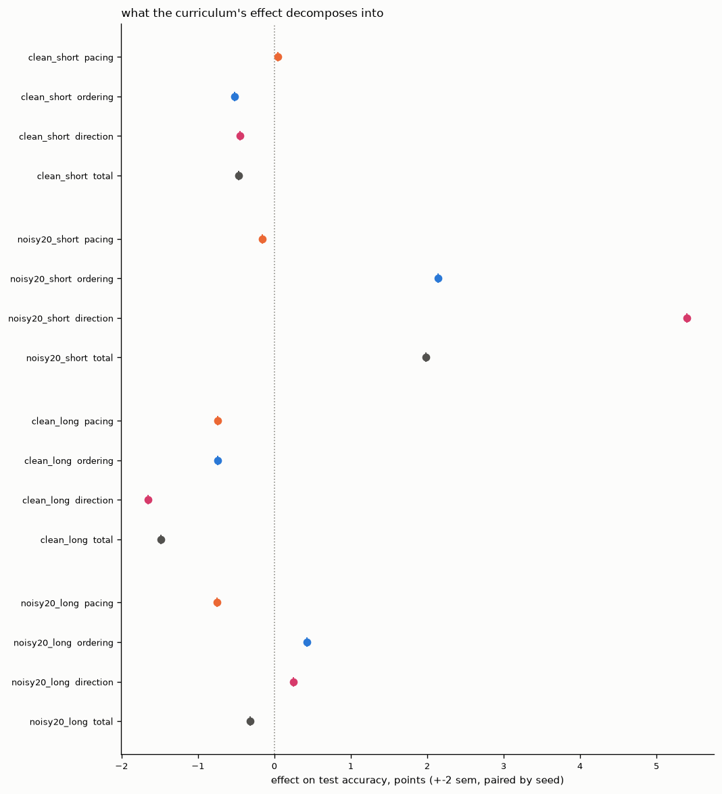
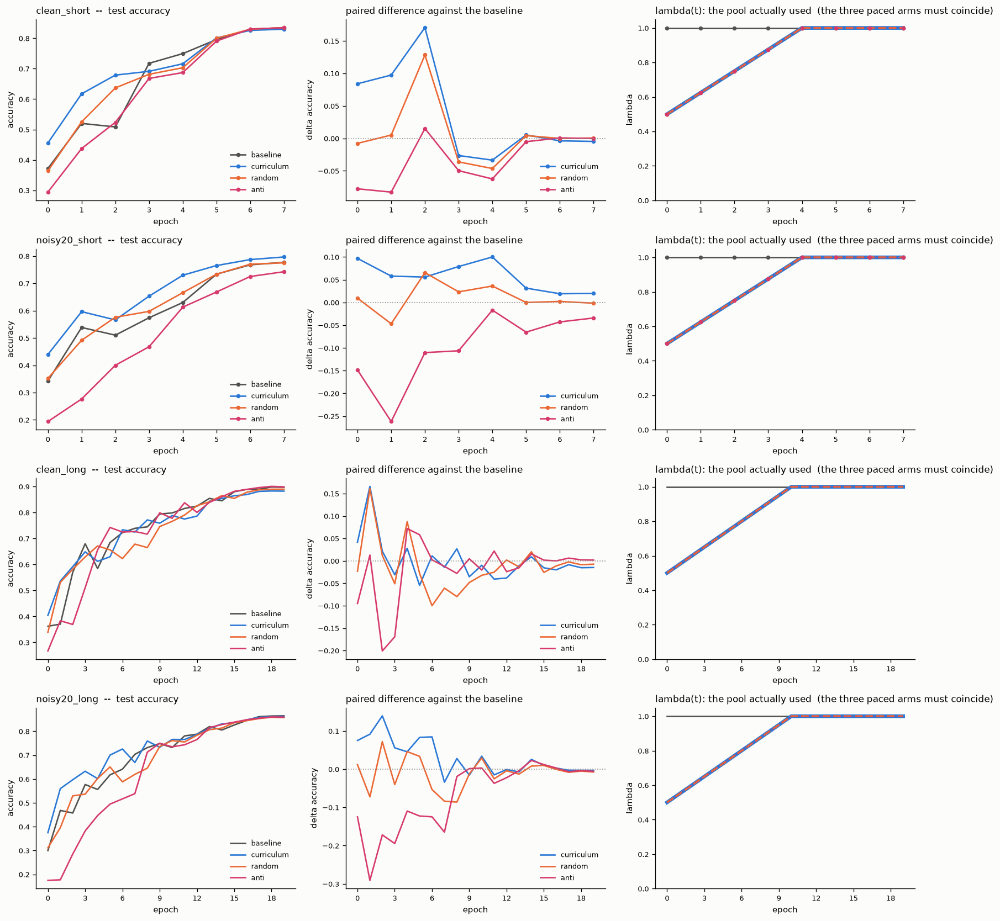

# Curriculum learning as a continuation method: what is the pacing, and what is the order?

> **Status: run complete.** 16/16 arms, 44.6 min on a Kaggle T4, nothing cut by
> the budget. §1–§5 were written *before* the numbers came back, predictions
> included, so §6 can disagree with them — and on the main point it does.

**In one line:** the repetition that a fixed step budget hands the easy examples
buys almost nothing; the ordering does the work, but only converts into final
accuracy when the labels are noisy *and* the budget is short.

---

## 1. The question

A curriculum arm differs from its baseline in **two** ways, not one.

1. It sees the examples in a chosen order — easy ones first.
2. It sees the early pool **repeatedly**, because an epoch is a fixed number of
   SGD steps whatever the pool holds. At λ = 0.5 each visible example is drawn
   twice per epoch while the baseline draws each of its once. Over a 20-epoch run
   with a 10-epoch ramp, the easy decile of the ordering collects **24.4**
   exposures and the hard decile **10.0**, against 20.0 each for the baseline.
   Same total draws, different distribution.

So an accuracy gap between "baseline" and "curriculum" cannot say which of the
two moved it. This is not a defect of this implementation — it is what a pacing
function *does* under a fixed step budget, and it is the protocol Wu, Dyer &
Neyshabur sweep. But it means the usual two-arm comparison is structurally
unable to answer the question, and that is what this study is built to fix.

## 2. Why this is a homotopy method

A **continuation** (or homotopy) method solves a hard problem by not attacking it
directly. Given a target `F₁(x) = 0` that Newton's method would fail on from any
available starting point, one embeds it in a family `F_λ` with `F₀` easy and a
known solution, then tracks the solution as λ goes 0 → 1: solve, deform a little,
re-solve from where you landed. Each solved problem supplies the initial guess
for the next. It is standard numerical analysis, and in optimisation it appears
as *graduated non-convexity* (Blake & Zisserman, 1987) and the Gaussian-homotopy
line of work: smooth the objective until it is nearly convex, minimise, then
sharpen it back in steps.

Curriculum learning is presented as exactly this by Bengio et al. (2009), and the
mapping here is:

```
L_λ  =  the training objective restricted to the λ easiest examples
L_0  =  the easy subproblem  (λ = easy_frac, 25 000 images)
L_1  =  the real one         (all 50 000 images)
λ(t) =  the path, one increment per epoch
```

Bengio et al. take the two endpoints in a **single jump** — which is `pacing:
step` in this code. Walking them in increments is what a continuation method
actually does, and the shape of the walk (`linear`, `quadratic`, `root`, `exp`,
`step`) is a knob rather than a separate experiment.

**Three honest gaps between this and a textbook continuation**, because the
analogy is what the framing rests on and overselling it would be the easiest
mistake to make here:

- **No re-convergence per level.** The run does one epoch of SGD on `L_λ`, then
  increments λ and continues from where it is. It is a continuation at *one step
  per level*, not to convergence, so the sequence θ(0)…θ(R) is a sequence of
  iterates, not a path of minima. Nothing here tracks a solution branch, and no
  implicit-function-theorem guarantee applies.
- **The deformation is combinatorial, not analytic.** Graduated non-convexity
  smooths the loss surface with a parameter that provably convexifies it in the
  limit. Subsampling by difficulty does not provably smooth anything; that `L_0`
  is better conditioned than `L_1` is an *assumption*, and under label noise it
  becomes a measurable one — which is why the noisy regimes are in the grid.
- **Two conditions decide whether it can help at all.** `L_0` must genuinely be
  easier, and the gap between `L_0` and `L_1` must be real. If both ends are
  equally well-posed, the homotopy connects two nearly identical points and
  cannot buy anything — and that is not a failure of the method, it is the
  absence of a difficulty to bridge. Modern CIFAR-10 with a residual network is
  plausibly exactly that case, which is the most economical explanation for the
  field's negative results.

## 3. The method

Following Wu, Dyer & Neyshabur (ICLR 2021), a curriculum factorises into a
**scoring** function (which examples are easy) and a **pacing** function g(t)
(how fast the visible subset grows), with each minibatch drawn uniformly from the
current subset at a fixed step budget. Four arms per regime hold one of the two
fixed while the other moves:

| arm | scoring | pacing | isolates |
| --- | --- | --- | --- |
| `baseline` | — | none | the reference |
| `curriculum` | cross-fit teacher, easy-first | the ramp | the effect as usually reported |
| `random` | a shuffle | **the same ramp** | pacing with no difficulty information |
| `anti` | the same teacher, hard-first | the same ramp | the direction of the ordering |

which decomposes the effect, every difference paired by seed:

```
pacing    = random     − baseline      the smaller pool and its repetition
ordering  = curriculum − random        the difficulty ranking itself
direction = curriculum − anti          easy-first against hard-first
total     = curriculum − baseline   =  pacing + ordering
```

Pairing means the arms share a seed, hence their initialisation and their
corrupted labels, so that much does not vary between them.

**Difficulty** is one number per example: the margin of the true class over its
best competitor, read un-augmented in `eval()` from a **cross-fit teacher** — two
models, each trained on the half it does not score, so nothing is ever ranked by
a model that trained on it. That removes the leak that forces a self-scored
ranking to be read early: a converged network is right about 99.9% of its own
train set, and under label noise right about the wrong labels too. The teacher
trains on the same corrupted labels the arms do; one that needed clean labels
would be assuming away the problem it is meant to help with.

## 4. The grid

ResNet-20 (0.27M parameters), SGD + nesterov, cosine with warmup, crop + flip,
λ from 0.5 to 1 on a linear ramp over half the budget, **one seed per arm**.

The full 2×2 of the two axes Wu et al. identify — training budget and label noise
— rather than three of its four cells, so the grid can say whether they interact:

| regime | epochs | ramp | label noise | why it is here |
| --- | --- | --- | --- | --- |
| `clean_short` | 8 | 4 | 0 | short budget — where Wu et al. find an effect |
| `noisy20_short` | 8 | 4 | 0.2 | short budget *and* noise — the other positive regime |
| `clean_long` | 20 | 10 | 0 | the null control: a comfortable budget on clean data |
| `noisy20_long` | 20 | 10 | 0.2 | noise at a comfortable budget — the cell the earlier ResNet-18 probe ran |

4 regimes × 4 arms × 1 seed = 16 runs plus two cross-fit teachers (one per noise
level, shared by that level's short and long regime, which also makes those two
comparable to each other), 224 epochs, 37–75 min on a T4. `budget_min` cuts the
tail rather than the middle and `study.json` records what was cut.

## 5. What the literature predicts

Written down before looking, so the results can disagree with it.

**Bengio, Louradour, Collobert & Weston (ICML 2009)** introduce curricula as
continuation and report gains: on a shape-recognition task where an easier
generated dataset precedes the target one, and on a language model whose
vocabulary grows over successive passes. Both are compared at a fixed number of
updates. Note that the shape experiment's easy set is a *separate* dataset, so it
carries no pool-shrinkage repetition; the vocabulary experiment does, and does
not control for it.

**Wu, Dyer & Neyshabur (ICLR 2021)** sweep scoring × pacing at scale and find
**essentially no benefit on standard benchmarks**. Benefits appear in two regimes
only: a **limited training-time budget**, and **noisy labels**. Their sharpest
result for us is that in those regimes a *random* ordering with the same pacing
recovers much of the gain — i.e. much of what is usually credited to the
curriculum is bought by the pacing.

There is also a **counter-tradition worth naming**, which is why `anti` is not a
strawman: hard-example mining and focal-loss-style reweighting improve clean-data
training by emphasising exactly the examples a curriculum defers. If ordering
mattered the way the curriculum story says, hard-first should be reliably worse
everywhere. It is not obvious that it is.

So, per cell:

| | expected `total` | expected `ordering` | expected `direction` |
| --- | --- | --- | --- |
| `clean_long` | ≈ 0 | ≈ 0 | ≈ 0 |
| `clean_short` | small, possibly positive | ≈ 0 — pacing carries it | small |
| `noisy20_short` | positive | possibly non-zero: under noise "easy" ≈ "correctly labelled" | positive: hard-first feeds the noise first |
| `noisy20_long` | small; the earlier ResNet-18 probe found −1.4 pt at 30 epochs | ? | positive |

The one place the ordering should genuinely carry information is under noise,
because there the difficulty ranking is close to a *label-cleanliness* ranking —
a different and much stronger claim than "easy examples teach better".

*Citations are from memory; the fine detail of the 2009 protocols should be
checked against the papers before this is submitted.*

## 6. Results

16 arms, 44.6 min on a T4, nothing cut. Full tables in `report_tables.md`.

### 6.0 The design checks out first

None of §6 means anything unless these hold, so they are reported before the
numbers they license:

| check | result |
| --- | --- |
| corrupted labels in the initial easy pool (`curriculum`, noisy) | **1.0%** against 20.0% in the train set |
| same, `random` | **19.8%** — the control lands on the base rate, as it must |
| same, `anti` | **39.0%** — the hard end really is the mislabelled end |
| teacher test accuracy (clean / noisy) | 73.9%, 73.2% / 67.4%, 67.5% |
| per-fold margin means, clean / noisy | 2.11 vs 2.03 (σ ≈ 3.1) / 0.09 vs 0.09 (σ ≈ 2.3) — the folds are on one scale |
| `lam`, `pool_k` across `curriculum`, `random`, `anti` | identical; flat at 1.0/N for `baseline` |

The margin ranking under noise is essentially a label-cleanliness ranking: 1.0%
against 20.0% is as clean a separation as this design could have asked for.

### 6.1 The decomposition, on final test accuracy

Points of test accuracy, paired by seed. **At one seed, seed-to-seed spread on
CIFAR-10 is around half a point, so only the entries in bold are worth reading;
the rest is inside the noise.**

| regime | pacing | ordering | direction | **total** |
| --- | --- | --- | --- | --- |
| `clean_short` | +0.05 | −0.52 | −0.45 | −0.47 |
| `noisy20_short` | −0.16 | **+2.14** | **+5.40** | **+1.98** |
| `clean_long` | −0.74 | −0.74 | **−1.65** | **−1.48** |
| `noisy20_long` | −0.75 | +0.43 | +0.25 | −0.32 |



### 6.2 The same decomposition, on the whole trajectory

Final accuracy hides a large transient. Taking the same differences on the AUC
(mean test accuracy across all epochs) instead:

| regime | pacing | ordering | **total** |
| --- | --- | --- | --- |
| `clean_short` | +0.60 | **+3.01** | **+3.61** |
| `noisy20_short` | **+1.10** | **+4.65** | **+5.75** |
| `clean_long` | **−1.18** | **+1.15** | −0.03 |
| `noisy20_long` | **−1.02** | **+3.98** | **+2.96** |



### 6.3 Four findings

**1. The repetition buys almost nothing — the premise of this whole study turns
out to be a small effect.** `random` has *exactly* the pacing of `curriculum`,
hence exactly its repetition (easy decile drawn 10.1 times against the baseline's
8.0 in the short regimes, 24.4 against 20.0 in the long ones), and no difficulty
information at all. Its final accuracy lands within 0.8 points of the baseline in
every cell, and on the wrong side of it in three of four. Whatever the curriculum
does here, it is not the repetition doing it. **This contradicts the prediction in
§5**, which expected pacing to carry the short-budget gain, and it is a partial
disagreement with Wu et al.'s finding that a random ordering recovers much of the
benefit.

**2. Easy-first speeds up training everywhere, and that is a different claim from
helping.** The ordering effect on AUC is positive in all four cells (+1.15 to
+4.65). On final accuracy it survives in exactly one. The middle column of
`study.png` shows it directly — the curriculum's paired difference against its
baseline:

| regime | epoch 0 | peak | final |
| --- | --- | --- | --- |
| `clean_short` | +8.4 | **+17.0** (ep 2) | −0.5 |
| `noisy20_short` | +9.7 | +10.0 (ep 4) | **+2.0** |
| `clean_long` | +4.2 | **+16.6** (ep 1) | −1.5 |
| `noisy20_long` | +7.5 | +14.0 (ep 2) | −0.3 |

A curriculum is, in this regime, a *warm start*: a 17-point lead that decays to
nothing as the ramp closes. A two-arm study that stopped at epoch 2, or reported
AUC, would have called that a win in every cell.

**3. It converts into final accuracy only where noise and a short budget meet.**
`noisy20_short` is the single cell with a real total (+1.98), and it is ordering
(+2.14) not pacing (−0.16) that pays for it. Give the same noisy problem 20
epochs instead of 8 and the effect is gone (+0.43 ordering, −0.32 total): the
baseline catches up. **This is what the 2×2 was for** — with only three cells the
gain at `noisy20_short` would have read as "noise is where curricula work",
whereas it is really "noise *and* too little time is where they work".

**4. Direction flips sign with noise, and `anti` was not a strawman.** Hard-first
is catastrophic under noise at a short budget (−5.40 against easy-first; it opens
on a pool that is 39% mislabelled and never recovers). On clean data at a
comfortable budget it is the *best* arm of the four — 89.89% against the
baseline's 89.72% and the curriculum's 88.24%, i.e. direction = −1.65 in favour
of hard-first. That is the hard-example-mining tradition showing up exactly where
§5 said it might, and it is the sharpest evidence in the grid that "easy examples
teach better" is not a general fact but a property of a noisy label set.

### 6.4 Predictions against outcomes

| cell | §5 predicted | observed |
| --- | --- | --- |
| `clean_long` | all ≈ 0 | total −1.48; the null holds on AUC (−0.03), not on final accuracy |
| `clean_short` | small positive total, pacing carries it | total −0.47; **pacing did not carry it, and there was nothing to carry** |
| `noisy20_short` | positive total, ordering possibly non-zero | **correct, and stronger than expected**: total +1.98, all of it ordering |
| `noisy20_long` | small; earlier probe found −1.4 pt | total −0.32, same sign, smaller |

The one prediction that failed is the one that mattered most, and it failed in
the direction that makes the original worry — that repetition was quietly
inflating curriculum results — **not** the explanation here.

### 6.5 What this says about the homotopy framing

§2 named two conditions for a continuation to be worth running: `L_0` must be
genuinely easier, and the gap to `L_1` must be real. The grid measures both, and
they come apart.

**`L_0` was genuinely easier, everywhere.** That is what the positive ordering
effect on AUC is: starting on the easy subproblem gets you further, faster, in
all four cells. The continuation does what a continuation is supposed to do at
the start of the path.

**The gap was only real under noise.** On clean CIFAR-10, `L_0` and `L_1` are
both well-posed problems for a ResNet, so the path connects two nearly identical
points and the head start has nothing to transport — the baseline reaches the
same place by attacking `L_1` head-on, and by 20 epochs it has gone slightly
further. Under 20% permuted labels, `L_1` genuinely contains contradictions that
`L_0` (1.0% corrupted) does not, and there the head start survives to the end —
but only while the budget is too short for the baseline to close it.

So the honest reading of the continuation analogy is: **it is a warm start whose
value is exactly the value of the gap it bridges.** It is not a better path to
the same optimum; it is a faster route to a point the baseline also reaches,
worth something only when the target problem is genuinely ill-posed and time is
genuinely short. That is a narrower claim than "curriculum learning is a
continuation method", and it is the one this grid supports.

A caveat that belongs here rather than in §7: this is continuation at *one step
per level*, not to re-convergence, so it cannot distinguish "the path does not
help" from "the path was walked too fast to help". A schedule that re-converged
at each λ is a different experiment and is not run here.

## 7. Limits

- **One seed per arm, so no interval at all — this is the binding limit and the
  first thing to fix.** Seed-to-seed spread on CIFAR-10 is around half a point,
  so the four effects that survive that bar (`noisy20_short` ordering +2.14 and
  direction +5.40, `clean_long` direction −1.65 and total −1.48) are *plausible*
  and everything else in §6.1 is inside the noise and should not be read at all.
  Nothing here is established in the statistical sense. `seeds: "0,1,2"` in
  `studies/pacing_vs_order.yaml` restores the intervals, costs ~2h15 rather than
  45 min, and is one edit — it is what would turn §6.3 from four observations
  into four results.
- **AUC is a summary, not a second experiment.** §6.2 re-uses the same 16 runs;
  it is a different projection of the same data, not independent evidence, and
  its "significance" is bounded by the same single seed.
- **One path.** `pacing: linear`, `easy_frac: 0.5`, ramp at half the budget. The
  shape is a knob and it is not swept — including `step`, Bengio et al.'s own
  schedule.
- **One scoring function.** A transfer teacher's margin. Loss-based and
  learned-epoch (c-score-like) rankings are untested and do not agree with each
  other in the literature.
- **One noise level, one architecture.** 20% permuted labels, ResNet-20. Severe
  noise (40%) is untested, and given that §6.3 traces the whole effect to the
  gap between `L_0` and `L_1`, harder noise is the most likely place for the
  effect to grow — that is the obvious next cell.
- **The continuation is one step per level**, as §2 and §6.5 say. Conclusions are
  about this schedule, not about continuation methods in general.
- **"Short budget" here means 8 epochs of a 20-epoch recipe**, not a
  wall-clock-matched comparison. The short arms also run a compressed cosine, so
  budget and schedule shape move together; disentangling them is another grid.

## 8. Reproduce

```sh
make smoke                                   # the same grid on CPU: plumbing only
make push                                    # rebuilds, pushes AND starts the T4 run
make status && make pull
python analyze.py out/runs/20260909-085556_pacing_vs_order   # the run reported here
```

Four checks in the output, in order of what they would invalidate:

1. `lam` and `pool_k` in `history.jsonl` flat at 1.0/N for `baseline` and
   **identical** across `curriculum`, `random`, `anti`. If those three diverge,
   the decomposition means nothing.
2. The teacher's folds cover every index exactly once, and the per-fold margin
   means are close relative to their spread — one ranking is built from several
   models, and they have to be on the same scale.
3. In the noisy regimes, the corrupted share of the initial easy pool is well
   below 20% for `curriculum`, and lands *on* 20% for `random` — the control
   working as designed.
4. Past the ramp `pool_at` returns `None`, so the paced arms take the baseline's
   exact code path. Note what that is and is not: the objective and the code path
   coincide, the weights do not. A pooled epoch draws from the generator
   differently from an unpooled one, so the streams diverge during the ramp and
   never re-converge.

## References

- Bengio, Louradour, Collobert & Weston. *Curriculum Learning.* ICML 2009. — the
  curriculum as a continuation method; their two-stage path is `pacing: step`.
- Wu, Dyer & Neyshabur. *When Do Curricula Work?* ICLR 2021. — the
  scoring × pacing factorisation, the random-ordering control this study is built
  on, and the two regimes where curricula help: short budgets and noise.
- Blake & Zisserman. *Visual Reconstruction.* MIT Press, 1987. — graduated
  non-convexity, the optimisation ancestor of the continuation framing.
